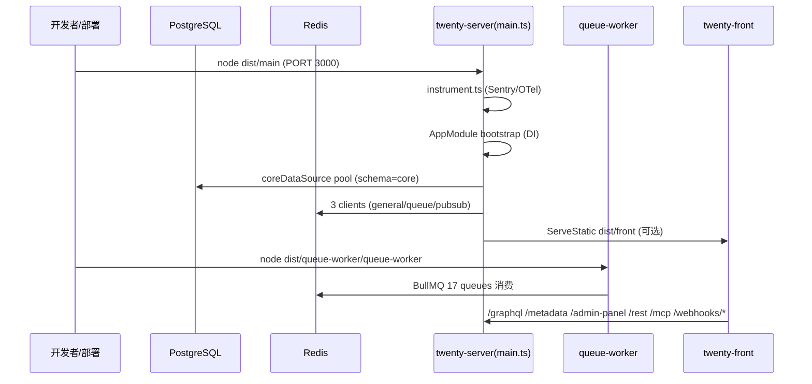
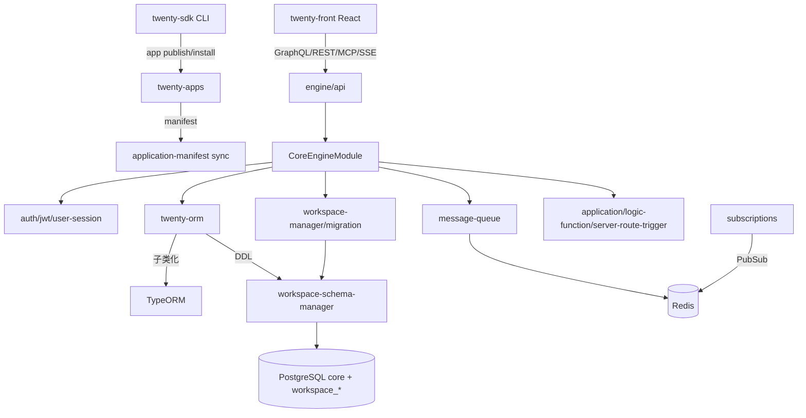
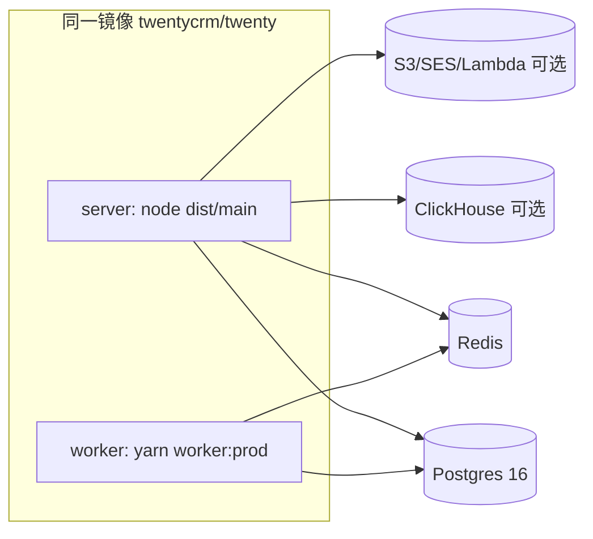

# 源码架构 (SOURCE_ARCHITECTURE)

## 分析快照

- 分支：`main`；HEAD：`4dbc5a567ef4f8465ca69632cc9fec8eff388732`
- 工作区状态：任务开始时 clean；本任务仅新增 `./docs-analysis/`。
- 子模块状态：无任何 Git 子模块。
- 分析范围：仓库总体结构、各 package 职责、入口、分层、模块依赖、数据/控制流、生成代码、技术债。
- 未覆盖范围：`node_modules/`、构建产物、第三方依赖内部、逐函数穷举。

## 证据分类

- `[Evidence]` / `[Inference]` / `[Unknown]`（同前）。本文章节性结论尽量带 `path:line`。

## 核心结论

- `[Evidence]` 22 个 package 的 Nx/Yarn monorepo，核心是 **`twenty-server`（NestJS）+ `twenty-front`（React/Vite）+ 共享 worker**，外加 **`twenty-sdk`（CLI + define* API）+ `twenty-apps`（应用市场/示例 App）** 构成的扩展生态。
- `[Evidence]` **数据层只有 1 个 `core` schema（含 core + metadata 表）+ 每工作区 1 个 `workspace_<base36(uuid)>` schema**——**不存在独立的 metadata schema/DataSource**（与某些前提相反，已校正）。
- `[Evidence]` 模块聚合的真实根是 `CoreEngineModule`（约 80 个模块），而非 `app.module.ts`。

---

## 1. 仓库总体结构（Git 跟踪）

顶层目录：`.claude`、`.cursor`、`.github`、`.vscode`、`.yarn`、`packages` + 根配置（`package.json`、`nx.json`、`tsconfig.base.json`、`yarn.lock`、`jest.preset.js`、`.oxfmtrc.jsonc`、`.mcp.json`、`CLAUDE.md`、`README.md`、`LICENSE`）。证据：`git ls-tree HEAD`。

`packages/` 下 20 个 package 目录（Yarn workspace 声明 18 个，`twenty-apps`/`twenty-docker` 为非 workspace 基础设施）。证据：`package.json:85-106`、`ls packages/`。

### 顶层 package 职责

| package | 类型 | 职责（证据） | 关键性 |
| -- | -- | -- | -- |
| `twenty-server` | app | NestJS 后端 + worker + CLI 命令；核心引擎 | 关键运行时 |
| `twenty-front` | app | React/Vite 前端 SPA | 关键运行时 |
| `twenty-ui` | lib | 共享 UI 组件 + 主题（`theme-light/dark.css`、`THEME_LIGHT/DARK`） | 关键（前后端共享） |
| `twenty-shared` | lib | 类型/常量/翻译/工具（`ConnectedAccountProvider`、`MessageChannelType`、`AppLocales` 等） | 关键（跨端契约） |
| `twenty-utils` | lib | 通用工具（含 `setup-dev-env.sh`） | 辅助 |
| `twenty-sdk` | lib+bin | `twenty` CLI（`app publish/install/deploy/uninstall`、dev、remote）+ `define*` authoring API | 关键（扩展入口） |
| `twenty-client-sdk` | lib | 浏览器端 SDK（被 server build 拷贝到 `dist/assets` 供前端下载） | 运行时依赖 |
| `twenty-emails` | lib | React Email 邮件模板 | 运行时（邮件） |
| `twenty-front-component-renderer` | lib | 远程渲染 App 的 front-component（依赖 `@remote-dom/react`） | 关键（App 渲染） |
| `twenty-apps` | 非ws | 应用市场/公共 App（`public/slack`、`fixtures/minimal-app`、`examples/document-generator`） | 关键（扩展实例） |
| `twenty-docker` | 非ws | Dockerfile、compose、helm、k8s、grafana、otel | 关键（部署） |
| `twenty-e2e-testing` | app | Playwright E2E | 测试 |
| `twenty-website` | app | Next.js 营销站 | 营销 |
| `twenty-docs` | app | Mintlify 文档站 | 文档 |
| `twenty-zapier` | app | Zapier 集成 | 集成 |
| `create-twenty-app` | app | 脚手架 CLI（`npx create-twenty-app`） | 开发者入口 |
| `twenty-cli` | app | **已 DEPRECATED**（提示用 twenty-sdk） | 废弃 |
| `twenty-codex-plugin` | app | Codex 插件 | 工具 |
| `twenty-oxlint-rules` | lib | 自定义 oxlint 插件（lint 目标依赖） | 工具链 |
| `twenty-claude-skills` | lib | Claude skills 资源 | 工具 |

## 2. twenty-server 内部分层

`packages/twenty-server/src/` 顶层：`main.ts`、`app.module.ts`、`instrument.ts`、`command/`、`queue-worker/`、`database/`、`engine/`、`modules/`、`filters/`、`constants/`、`utils/`。

### engine/ 子结构（核心引擎）

`git ls-files .../src/engine` 顶层目录：`api`、`core-modules`、`metadata-modules`、`twenty-orm`、`workspace-datasource`、`workspace-manager`、`workspace-cache(-storage)`、`core-entity-cache`、`dataloaders`、`decorators`、`guards`、`middlewares`、`subscriptions`、`object-metadata-repository`、`workspace-event-emitter`、`trash-cleanup`、`constants`、`utils`。

- `[Evidence]` `engine/api`：`graphql`（core/metadata/admin + 动态 `workspace-resolver-builder`）、`rest`、`mcp`。
- `[Evidence]` `engine/core-modules`：约 80 个核心模块（auth、jwt、user-session、workspace、billing、feature-flag、file、redis-client、message-queue、telemetry、logger、exception-handler、twenty-config、application、logic-function、server-route-trigger、i18n、role、upgrade、event-logs ...）。
- `[Evidence]` `engine/metadata-modules`：object-metadata、field-metadata、view、role、permission-flag、permissions、ai（含 9 个 AI 子模块）、connected-account、data-source(deprecated) 等。
- `[Evidence]` `engine/twenty-orm`：自研 ORM（`GlobalWorkspaceDataSource`、`WorkspaceEntityManager`、`WorkspaceRepository`、`workspace-schema-manager`）。
- `[Evidence]` `engine/subscriptions`：`subscription.service`、`event-stream.resolver`、各类 event publisher。

### modules/（业务模块，22 个）

`attachment, blocklist, calendar, call-recording, company, connected-account, connected-account-sync-webhooks, contact-creation-manager, dashboard, dashboard-sync, emailing, match-participant, messaging, messaging-webhooks, note, onboarding-invite-suggestions, opportunity, person, task, timeline, workflow, workspace-member`。

- `[Evidence]` **`ModulesModule` 只注册其中 6 个**（Messaging、Calendar、ConnectedAccount、OnboardingInviteSuggestions、Workflow、WorkspaceMember）。证据：`packages/twenty-server/src/modules/modules.module.ts:10-22`。
- `[Inference]` 其余（company/person/opportunity/task/note/attachment 等）**不需要 Nest 模块注册**，因为它们是元数据驱动的标准对象，由动态 `workspace-resolver-builder` + `WorkspaceEntityManager` 通用处理；少数（dashboard/emailing/timeline 等）在 `CoreEngineModule` 内直接 import。

## 3. 应用入口与启动流程

详见 [[运行时架构]]。要点：
- `[Evidence]` HTTP 入口 `main.ts`（`NestFactory.create<NestExpressApplication>`，无 `enableShutdownHooks`）。
- `[Evidence]` worker 入口 `queue-worker/queue-worker.ts`（`createApplicationContext`，**有** `enableShutdownHooks`）。
- `[Evidence]` CLI 入口 `command/command.ts`（`nest-commander` CommandFactory）。

## 4. 模块依赖方向

- `[Evidence]` 顶层依赖：`app.module.ts` → `CoreEngineModule`（聚合）、`ModulesModule`、5 个 API 模块、infra（TwentyORM/GlobalWorkspaceDataSource/ClickHouse/Middleware/Jwt/UserSession/...）。证据：`app.module.ts:55-93`。
- `[Evidence]` `CoreEngineModule` 是真实聚合根（约 80 模块，含 Auth/Billing/Workspace/FeatureFlag/FileStorage.forRoot/RedisClient/Telemetry/Role/AiModels/AiBilling/Application/LogicFunction...），并注册额外全局 filter（Billing/Permissions）。证据：`packages/twenty-server/src/engine/core-modules/core-engine.module.ts:87-184`。
- `[Evidence]` 共享契约下沉到 `twenty-shared`（类型/常量），跨端复用。证据：`packages/twenty-shared/src/types/*`。

## 5. 数据依赖 / 控制流 / 状态所有权

- `[Evidence]` 工作区记录的"真相源"是**工作区 schema 的物理表**；其结构由 `core.objectMetadata/fieldMetadata` 描述，并通过 `workspace-migration` 同步成 DDL。
- `[Evidence]` 请求级状态（auth 上下文、workspace 上下文）通过全局 `AsyncLocalStorage`（`workspace-auth-context.storage.ts`、`getWorkspaceContext()`）传递，**绕过 DI**。
- `[Evidence]` 配置真相源：`TwentyConfigService`（env 优先，DB 覆盖，env-only 例外），但 TypeORM 连接在 `core.datasource.ts` 直接读 `process.env`（bootstrap 鸡生蛋）。

## 6. 配置系统 / 错误模型 / 日志

- `[Evidence]` 配置：`config-variables.ts`（约 2300 行，250+ 变量，`@ConfigVariablesMetadata` + class-validator 装饰器）；`TwentyConfigService.get`。证据：`config-variables.ts:72`、`twenty-config.service.ts:56-70`。
- `[Evidence]` 错误：全局 `UnhandledExceptionFilter`（HTTP，含静默吞分支 `:20-22`）+ Billing/Permissions/Config GraphQL filter；GraphQL 错误经 `global-exception-handler.util.ts`（4xx 不上报）。证据：`unhandled-exception.filter.ts`、`global-exception-handler.util.ts:46-177`。
- `[Evidence]` 日志：自研 `LoggerService`（`main.ts:47,77`）。

## 7. 安全边界

- `[Evidence]` 鉴权：JWT(API_KEY/WORKSPACE_AGNOSTIC/ACCESS/APPLICATION_ACCESS) + cookie session + CSRF(Origin) + SAML/OIDC/Google/Microsoft OAuth；成员资格在 `JwtAuthStrategy.validate` 强校验。证据：`jwt.auth.strategy.ts:182-202,396`。
- `[Evidence]` RBAC：`WorkspaceEntityManager` 每次读写注入 `validateOperationIsPermittedOrThrow`。
- `[Evidence]` App 代码隔离：Lambda(subhosting)/本地子进程。证据：`logic-function-driver.factory.ts:46-112`。
- `[Evidence]` DDL 注入防护：`escapeIdentifier`/`remove-sql-injection.util.ts`。

## 8. 生成代码 / 第三方源码

- `[Evidence]` 前端生成：`generated/graphql.ts`(969 行)、`generated-metadata/graphql.ts`(9694 行)、`generated-admin/graphql.ts`(1407 行)，由 3 套 codegen 产出。
- `[Evidence]` 自动生成且可重建：`twenty-current-version.constant.ts`（`version:bump` 脚本）、instance command 模板、locales compiled。
- `[Evidence]` 第三方源码（vendored）：未发现明显 vendored 源码；`@remote-dom/react`、`@fontsource/*` 为正常依赖。

## 9. 部署结构

- `[Evidence]` 三进程：server（HTTP）、worker（BullMQ 消费）、db/redis（外部）。证据：`docker-compose.yml:3-135`。
- `[Evidence]` worker 与 server 同镜像，靠 command 区分；worker 设 `DISABLE_DB_MIGRATIONS=true`、`DISABLE_CRON_JOBS_REGISTRATION=true`。证据：`docker-compose.yml:61-71`。

## 10. 架构边界审计（重点章节）

| 审计项 | 结论 | 证据 |
| -- | -- | -- |
| 循环依赖 | `[Inference]` 未发现明显模块级循环（Nest DI 单向：app→CoreEngine→子模块）；但 `engine` 内部跨子目录互引常见，未逐一验证 | `core-engine.module.ts` |
| 跨层调用 | `[Evidence]` `core.datasource.ts` 直接读 `process.env` 绕过 `TwentyConfigService`（基础设施层穿透配置层） | `core.datasource.ts:5-8,41` |
| 全局可变状态 | `[Evidence]` auth/workspace 上下文用模块级 `AsyncLocalStorage` 单例；OTel 全局 meter provider、Sentry scope 为全局 | `workspace-auth-context.storage.ts:5-25`、`instrument.ts:119` |
| 隐式依赖 | `[Evidence]` `app.module.ts` 注释 `// TODO: Remove this middleware when all the rest endpoints are migrated to TwentyORM` 暗示 REST 迁移半完成 | `app.module.ts:46-53` |
| 模块职责重叠 | `[Evidence]` "DataSource metadata 实体"已 deprecated，与 `workspace.databaseSchema` 职责重叠，迁移中 | `data-source.entity.ts:15-17` |
| 数据访问泄漏 | `[Evidence]` 业务模块既可用 core repository 也可用 workspace entity manager；动态 schema 使"哪层负责哪类表"需靠约定 | `twenty-orm/*` |
| UI 与业务耦合 | `[Inference]` 前端 object-record(1891 文件) 既含 UI 又含字段/校验逻辑，单模块偏大 | `twenty-front/src/modules/object-record` |
| 平台代码泄漏 | `[Evidence]` `index.html` 含 iOS UA 检测 + viewport pin（平台特定逻辑泄漏到 HTML） | `index.html:44-60` |
| 错误边界 | `[Evidence]` 前端有 `AppErrorBoundary`；后端 filter 在 `headersSent` 时静默吞异常（边界不完整） | `unhandled-exception.filter.ts:20-22` |
| 生命周期边界 | `[Evidence]` server 无 `enableShutdownHooks`，worker 有 → 生命周期不对称 | `main.ts` vs `queue-worker.ts:24` |
| 类型定义≠实现 | `[Evidence]` `DataSourceEntity` 类型存在但 deprecated；通话录音 widget 类型存在但渲染组件 commit 自述待补 | `data-source.entity.ts`、commit `3cbcf999d6` |
| 配置存在≠启用 | `[Evidence]` `AUTH_COOKIE_SESSIONS_ENABLED` 默认关，需 PR label 才在 CI 测 | `ci-server.yaml:308` |

## 11. 技术债务 / 架构风险

1. `[Evidence]` 自研 TwentyORM 依赖 TypeORM 私有 API（`workspace-entity-manager.ts:30-32` import `EntityPersistExecutor` 等），升级易碎。
2. `[Evidence]` 每工作区一 schema → `pg_namespace` 无界增长 + 每上下文 entity metadata 重建（`entities:[]`）。
3. `[Evidence]` 迁移不 boot-enforced（`migrationsRun:false`），drift 静默。
4. `[Evidence]` 3 套 GraphQL 端点 + 3 套前端 codegen（excludes 脆弱）。
5. `[Evidence]` 设计令牌 3 源（JS THEME 对象 / `--t-*` CSS 镜像 / index.html FOUC 内联），靠人工 parity 测试。
6. `[Evidence]` 22 个业务模块目录但仅 6 个在 `ModulesModule` 注册（其余靠 CoreEngine/dynamic resolver，认知负担高）。

## 12. 文档与源码冲突

- `[Evidence]` 根 `CLAUDE.md` 的 "Package Structure" 列出 9 个 package，**实际 20 个**（缺 twenty-cli/sdk/client-sdk/codex-plugin/claude-skills/front-component-renderer/oxlint-rules/utils/create-twenty-app/twenty-apps）。证据：`CLAUDE.md` vs `ls packages/`。
- `[Evidence]` README 的 stack 描述准确（TS/Nx/NestJS+BullMQ+PG+Redis/React+Jotai+Linaria+Lingui）。证据：`README.md:143-148`。
- `[Evidence]` README 提 `npx twenty app:publish`，实际 bin 来自 `twenty-sdk`（`twenty-cli` 已废弃）。

## 已确认事实 / 合理推断 / Unknown

- 见各节内联。关键 Unknown：`engine` 内部是否存在更深层循环依赖（未逐 import 验证）；`twenty-apps` 非 workspace 是否影响其被 server 引用的方式。

## 批判性评估

- 真实聚合根是 `CoreEngineModule` 而非 `AppModule`/`ModulesModule`，使"模块注册"语义分散在三处，新开发者易误判哪些模块生效。
- 数据层"core+metadata 同 schema"与常见"metadata 独立 schema"心智模型不同，文档/工具若沿用旧模型会出错。

## 建设性改善建议

- `[Recommendation]` 在 `ModulesModule`/`CoreEngineModule` 顶部补注释说明"为何仅注册这 6 个 + 其余由 dynamic resolver/CoreEngine 处理"，降低认知负担。优先级：中；难度：低。
- `[Recommendation]` 为 server 补 `enableShutdownHooks` + 显式连接关闭。优先级：中；难度：低。
- `[Recommendation]` 更新 `CLAUDE.md` 的 Package Structure 至实际 20 个 package。优先级：低；难度：低。

## 主要证据索引

- `packages/twenty-server/src/app.module.ts:55-171`；`engine/core-modules/core-engine.module.ts:87-184`
- `packages/twenty-server/src/modules/modules.module.ts:10-22`
- `packages/twenty-server/src/database/typeorm/core/core.datasource.ts:40-89`
- `packages/twenty-server/src/engine/twenty-orm/entity-manager/workspace-entity-manager.ts:30-88`
- `packages/twenty-server/src/engine/workspace-datasource/workspace-datasource.service.ts:56-69`
- `packages/twenty-server/src/filters/unhandled-exception.filter.ts:20-22`
- `packages/twenty-server/src/engine/core-modules/auth/storage/workspace-auth-context.storage.ts:5-25`
- `package.json:85-106`；`CLAUDE.md`（Package Structure 章节）
