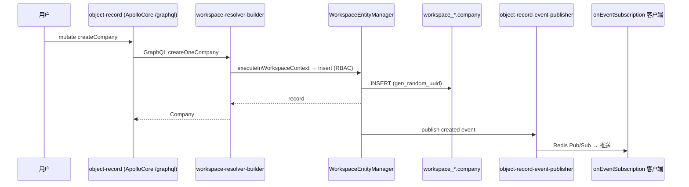
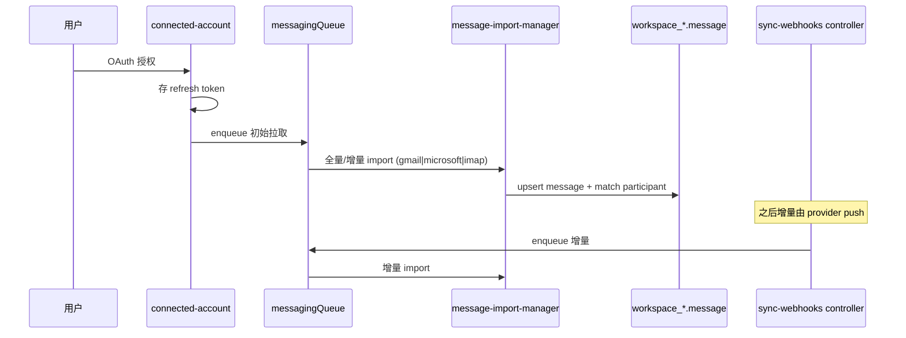
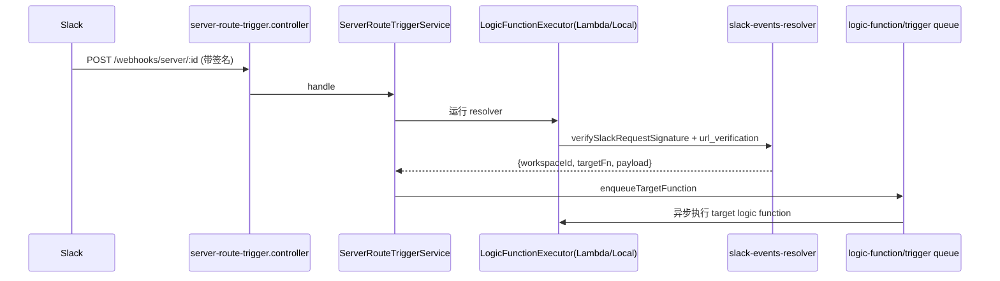
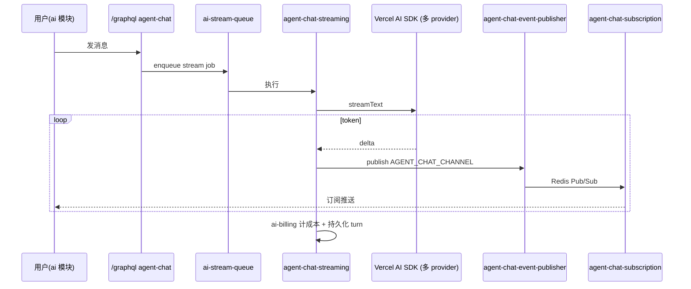
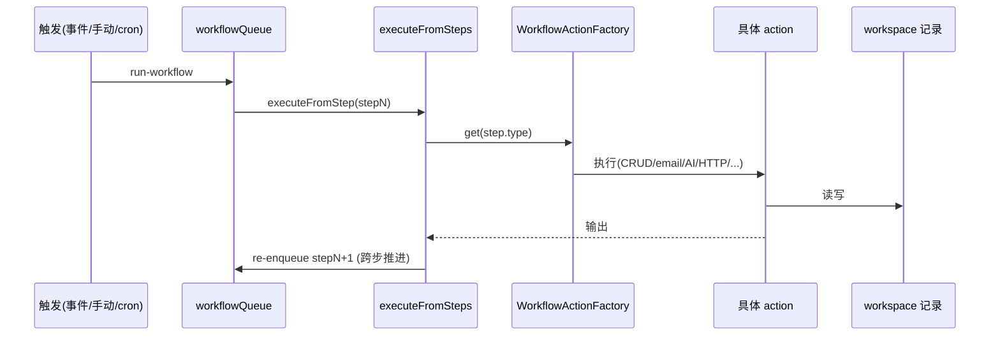
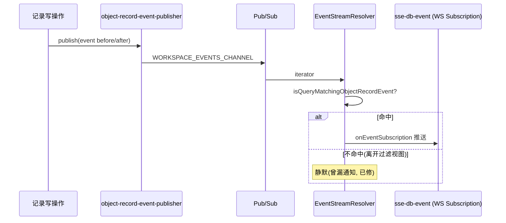

# 核心数据流 (核心数据流)

## 分析快照

- 分支：`main`；HEAD：`4dbc5a567ef4f8465ca69632cc9fec8eff388732`
- 工作区状态：任务开始时 clean；本任务仅新增 `./docs-analysis/`。
- 子模块状态：无。
- 分析范围：从源码追踪 6 条关键业务数据流（端到端），含触发点、模块边界、协议、持久化、事务/并发边界、错误路径。

## 证据分类

- `[Evidence]` / `[Inference]` / `[Unknown]`（同前）。

## 核心结论

- `[Evidence]` 六条核心流：① 创建记录；② 邮件账户同步；③ Slack App webhook 触发；④ AI Agent 流式聊天；⑤ 工作流执行；⑥ 记录变更实时推送。
- `[Evidence]` 公共特征：前端经 Apollo→GraphQL；后端经动态 workspace resolver→`executeInWorkspaceContext`→`WorkspaceEntityManager`（RBAC）→workspace schema；异步经 BullMQ；实时经 Redis Pub/Sub→GraphQL Subscriptions。

---

## 流 ① 创建一条记录（以 company 为例）

- **触发点**：用户在 `RecordIndexPage` 点 "New" → 填字段 → 保存。
- **输入**：`company` 对象字段值（按 `fieldMetadata`）。
- **关键函数/边界**：
  - 前端：`object-record` 模块 → `ApolloCoreProvider` mutate `/graphql`（typed document from `generated/graphql.ts`）。
  - 后端：动态 resolver（`workspace-resolver-builder`）→ service → `executeInWorkspaceContext`（设 schema+entity metadata+auth）→ `WorkspaceEntityManager.insert`（RBAC `validateOperationIsPermittedOrThrow`）。
- **持久化**：`workspace_<base36(id)>.company` 表（PK `gen_random_uuid()`）。
- **事务边界**：单 workspace 连接内（`WorkspaceEntityManager`）。
- **错误路径**：权限→`PermissionsGraphqlApiExceptionFilter`；校验→GraphQL error；非 500 不上报 Sentry。
- **源码证据**：`engine/twenty-orm/repository/global-workspace-orm.manager.ts:70`、`workspace-entity-manager.ts:77-88`、`engine/api/graphql/workspace-resolver-builder/`。

- **检查**：`[Inference]` 状态单一真相源（DB 表）；`[Evidence]` 无越层（前端不直连 DB）；`[Risk]` 跨 core/workspace 无跨池事务（本流不涉及 core 写）。

## 流 ② 邮件账户连接与增量同步

- **触发点**：Settings 连接 Google/Microsoft → OAuth；之后 cron + webhook 增量。
- **输入**：OAuth 授权码 → refresh token。
- **关键函数/边界**：
  - OAuth：`connected-account/oauth2-client-manager/drivers/{google,microsoft}` → 存 `ConnectedAccount`。
  - 拉取/同步：`messagingQueue` → `message-import-manager/drivers/{gmail,microsoft,imap}` → `message-folder-manager` → 写 `message` + `match-participant`（关联 person/company）。
  - webhook 入站：`connected-account-sync-webhooks.controller.ts`（Google Pub/Sub push / Microsoft Graph 通知）→ handler → 入队。
- **持久化**：workspace schema 的 `message`/`messageChannel`/`connectedAccount` 等。
- **事务/并发**：队列串行化（`messagingQueue`），token 过期由 `refresh-tokens-manager` 自动续。
- **错误路径**：provider API 失败→队列重试；token 失效→刷新或断连。
- **源码证据**：`modules/connected-account/oauth2-client-manager/drivers/`、`modules/messaging/message-import-manager/drivers/`、`connected-account-sync-webhooks/connected-account-sync-webhooks.controller.ts`、`drivers/{google,microsoft}/*notification.handler.ts`。

- **检查**：`[Evidence]` 多 provider 经 driver 抽象统一；`[Inference]` 同步幂等性依赖 upsert by providerMessageId（未逐行核）。

## 流 ③ Slack App webhook 触发（App 扩展运行时）

- **触发点**：Slack Events API → `POST /webhooks/server/:resolverLogicFunctionUniversalIdentifier`。
- **输入**：Slack 原始事件 + 签名头。
- **关键函数/边界**：
  - `server-route-trigger.controller.ts:20-28` → `ServerRouteTriggerService.handle`（`:51`）。
  - 加载 resolver logic function（`slack-events-resolver`）→ `LogicFunctionExecutorService` 执行（Lambda/Local driver）。
  - resolver 内 `verifySlackRequestSignature` + `url_verification` 应答 + 返回 `{workspaceId, targetLogicFunctionUniversalIdentifier, payload}`。
  - `enqueueTargetFunction`（`:149`）把目标函数（`slack-events-enqueue`）入队到目标 workspace。
- **持久化**：logic function 读写 workspace 记录（如 `slack-assistant-request` 对象，由 App 注入）。
- **并发/隔离**：logic function 在 Lambda/子进程内执行，故障隔离。
- **错误路径**：签名失败→拒绝；logic 失败→driver 隔离 + 队列重试。
- **源码证据**：`server-route-trigger.{controller,service}.ts`、`logic-function-driver.factory.ts:46-112`、`twenty-apps/public/slack/src/logic-functions/slack-events-resolver.ts:23-67`、`strip-slack-bot-mention.ts`、`reply-to-empty-slack-assistant-request.ts`（对应近期 commit）。

- **检查**：`[Evidence]` 真实运行时插件（非仅构建期）；`[Inference]` resolver 必须快速返回（Slack 3s 超时），重活交给 enqueue。

## 流 ④ AI Agent 流式聊天

- **触发点**：用户在 `ai` 模块发消息。
- **输入**：用户文本 + 上下文（agent、记录）。
- **关键函数/边界**：
  - 前端：`ai` 模块 → `/graphql` mutation 发起 + 订阅 agent chat。
  - 后端：`agent-chat.resolver` → `aiStreamQueue` → `agent-chat-streaming.service` → `SdkProviderFactoryService`（Vercel AI SDK，按 provider 建 client）→ LLM 流式。
  - 流式 token 经 `agent-chat-event-publisher` → Redis Pub/Sub `AGENT_CHAT_CHANNEL` → `agent-chat-subscription.resolver` → 前端订阅。
- **持久化**：agent run/turn 记录；`ai-billing` 计成本。
- **并发**：流式 drain 由 `AI_STREAM_SHUTDOWN_DRAIN_MS` 控制。
- **错误路径**：provider 错误→Sentry(vercelAI integration 记录 input/output)；流中断→订阅关闭。
- **源码证据**：`metadata-modules/ai/ai-chat/services/agent-chat-streaming.service.ts`、`ai-chat/resolvers/agent-chat(-subscription).resolver.ts`、`ai-chat/jobs/stream-agent-chat.job.ts`、`ai-models/services/sdk-provider-factory.service.ts:38-115`、`engine/subscriptions/subscription.service.ts`(agentChat)。

- **检查**：`[Evidence]` 状态可能多源（DB turn + Redis 流）；`[Risk]` Sentry `vercelAIIntegration(recordInputs/Outputs)` + `sendDefaultPii:true` → 用户消息可能进 Sentry。

## 流 ⑤ 工作流执行

- **触发点**：记录事件 / 手动 / 定时 → workflow run。
- **输入**：workflow version + 起始 step + 上下文记录。
- **关键函数/边界**：
  - 入队 `workflowQueue` → `run-workflow.job` → `WorkflowExecutorWorkspaceService.executeFromSteps`（`:72`，`MAX_EXECUTED_STEPS_COUNT=20`）。
  - 逐 step 经 `WorkflowActionFactory.get` 分派（18 种 action：CODE/LOGIC_FUNCTION/SEND_EMAIL/DRAFT_EMAIL/CREATE_CALENDAR_EVENT/CREATE|UPSERT|UPDATE|DELETE|FIND|PICK_RECORD/FORM/FILTER/IF_ELSE/ITERATOR/HTTP_REQUEST/AI_AGENT/EMPTY/DELAY）。
  - 每步后 re-enqueue（`MessageQueue.workflowQueue`）实现跨步推进。
- **持久化**：workflow run/step 输出记录；记录 CRUD 经 `WorkspaceEntityManager`。
- **事务/并发**：每步独立（步间经队列），`delayed-jobs-queue` 处理 DELAY。
- **错误路径**：step 失败→run 失败；迭代器/条件分支决定路径。
- **源码证据**：`modules/workflow/workflow-executor/workspace-services/workflow-executor.workspace-service.ts:55,68,72,98`、`factories/workflow-action.factory.ts:54-100`、`workflow-runner/`。

- **检查**：`[Inference]` 步间无跨步事务（每步独立提交）——若中途失败，已写记录不可自动回滚；`[Evidence]` `MAX_EXECUTED_STEPS_COUNT=20` 防失控。

## 流 ⑥ 记录变更实时推送（"SSE"）

- **触发点**：任何记录 CRUD 或元数据变更。
- **输入**：记录 event（before/after）。
- **关键函数/边界**：
  - publisher：`object-record-event-publisher` / `metadata-event-publisher` → Redis Pub/Sub `WORKSPACE_EVENTS_CHANNEL`/`EVENT_STREAM_CHANNEL`。
  - 订阅：前端 `sse-db-event` 模块（实际 WebSocket GraphQL Subscription）→ `EventStreamResolver.onEventSubscription` + `addQueryToEventStream/removeQueryToEventStream`。
  - 匹配：`isQueryMatchingObjectRecordEvent` 判断事件是否命中客户端注册的查询（UPDATE 时用 `after ?? before`，近期 commit `a47f566eb1` 修复了"记录离开过滤视图不通知"）。
- **持久化**：事件可落 `event-logs`（ClickHouse）。
- **错误路径**：订阅断线→前端重连；matcher 漏判→不推送（静默）。
- **源码证据**：`engine/subscriptions/event-stream.resolver.ts:49-169`、`subscription.service.ts:34-131`、`object-record-event/object-record-event-publisher.ts`、commit `a47f566eb1`。

- **检查**：`[Risk]` matcher 静默漏判会表现为"前端不刷新"，无错误路径；`[Evidence]` 实时走 WebSocket Subscription 而非真 SSE（MCP 才有真 SSE）。

## 跨流共性检查

- **重复转换**：`[Inference]` 元数据在前端有 3 真相源（Apollo cache / selectors / IndexedDB store），可能重复转换。
- **错误丢失**：`[Evidence]` `UnhandledExceptionFilter` headersSent 静默吞；GraphQL 4xx 不上报。
- **多真相源**：`[Evidence]` 记录真相=workspace 表；事件=Redis（瞬态）+ClickHouse（持久）。
- **越层访问**：`[Inference]` 前端严格经 GraphQL；后端 core/workspace 混用同一请求可能跨池。
- **事务边界**：`[Risk]` workflow 步间、core/workspace 跨池无原子。
- **非幂等**：`[Inference]` 邮件同步依赖 upsert 幂等键；webhook 重放风险（SES 有 SNS 签名校验，Slack 有签名校验）。
- **竞态**：`[Risk]` 同记录并发更新依赖 DB 行级控制（未深挖乐观锁字段）。

## 已确认事实 / 合理推断 / Unknown

- `[Evidence]` 6 条流均有源码链与近期 commit 佐证。
- `[Unknown]` 各 provider 同步幂等键与记录并发控制细节（未逐行核）。

## 批判性评估 / 建设性改善建议

- `[Recommendation]` 为 matcher 静默漏判加可观测（计数/告警）。优先级：中；难度：低。依据：commit `a47f566eb1`。
- `[Recommendation]` 明确 workflow 步间失败的事务语义文档化（补偿 vs 接受部分写）。优先级：中；难度：中。

## 主要证据索引

- `packages/twenty-server/src/engine/twenty-orm/repository/global-workspace-orm.manager.ts:70`；`entity-manager/workspace-entity-manager.ts:77-88`
- `packages/twenty-server/src/engine/core-modules/server-route-trigger/server-route-trigger.{controller,service}.ts`
- `packages/twenty-server/src/engine/core-modules/logic-function/logic-function-drivers/logic-function-driver.factory.ts:46-112`
- `packages/twenty-server/src/engine/metadata-modules/ai/ai-chat/services/agent-chat-streaming.service.ts`；`ai-models/services/sdk-provider-factory.service.ts:38-115`
- `packages/twenty-server/src/modules/workflow/workflow-executor/workspace-services/workflow-executor.workspace-service.ts:55-98`；`factories/workflow-action.factory.ts:54-100`
- `packages/twenty-server/src/engine/subscriptions/event-stream.resolver.ts:49-169`；`subscription.service.ts:34-131`
