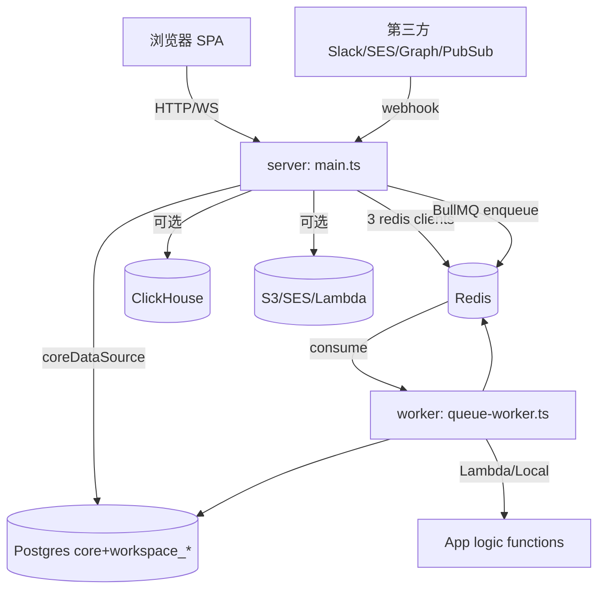
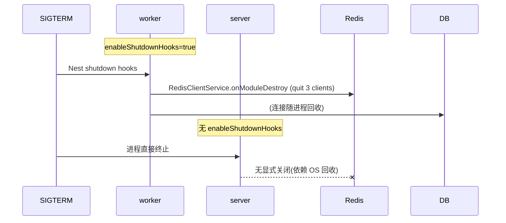

# 运行时架构 (运行时架构)

## 分析快照

- 分支：`main`；HEAD：`4dbc5a567ef4f8465ca69632cc9fec8eff388732`
- 工作区状态：任务开始时 clean；本任务仅新增 `./docs-analysis/`。
- 子模块状态：无。
- 分析范围：进程组成、初始化顺序、DI/生命周期、连接池、后台任务、调度、IPC/通信、关闭流程。
- 区分：**编译期 / 启动期 / 正常运行期 / 关闭期**。

## 证据分类

- `[Evidence]` / `[Inference]` / `[Unknown]`（同前）。

## 核心结论

- `[Evidence]` 运行时为 **3 进程模型**：`server`（HTTP/GraphQL/REST/MCP/cron 注册）、`worker`（BullMQ 消费）、外部 `db`+`redis`（可选 `clickhouse`）。server 与 worker 共用同一镜像/代码库，靠 entry/command 区分。
- `[Evidence]` server 无 `enableShutdownHooks`，worker 有 —— 关闭行为不对称。
- `[Evidence]` 请求级隔离依赖全局 `AsyncLocalStorage`（auth/workspace 上下文），而非 DI 的请求作用域。

---

## 1. 进程组成

| 进程 | 入口 | HTTP | 队列消费 | cron 注册 | Evidence |
| -- | -- | -- | -- | -- | -- |
| server | `src/main.ts` | 是（PORT, GraphQL/REST/MCP/webhooks） | 否（生产；Sync driver 下本地执行除外） | 是 | `main.ts:114`、`docker-compose.yml:61-71` |
| worker | `src/queue-worker/queue-worker.ts` | 否 | 是（17 队列） | 否(`DISABLE_CRON_JOBS_REGISTRATION=true`) | `queue-worker.ts:14`、`docker-compose.yml` |
| db | postgres:16 | — | — | — | `docker-compose.yml` |
| redis | redis(`noeviction`) | — | — | — | `docker-compose.yml` |

- `[Inference]` 单实例部署下 server 也可消费队列（`MessageQueueDriverType.Sync`），但生产 docker-compose 拆分 server/worker。

## 2. 初始化顺序（启动期）

### server（`main.ts:31-117`）
1. `import './instrument'`（副作用，先于 bootstrap）：按 env 初始化 Sentry（`EXCEPTION_HANDLER_DRIVER=SENTRY`）与 OTel metrics（`METER_DRIVER`）。
2. `setPgDateTypeParser()`：自定义 PG date 解析。
3. `NestFactory.create<NestExpressApplication>(AppModule, {bufferLogs, rawBody, snapshot?, httpsOptions?})`。
4. 取 `LoggerService`/`TwentyConfigService`/`ExceptionHandlerService`。
5. `process.on('unhandledRejection', ...)` → `shouldCaptureException` → `exceptionHandlerService.captureExceptions`。
6. `app.set('trust proxy', ...)`。
7. `applyCredentialedCors(app, ...)`（非 helmet）。
8. `app.use(session(getSessionStorageOptions(...)))`（express-session，Redis/内存后端）。
9. `useContainer(app.select(AppModule), {fallbackOnErrors:true})`（class-validator DI）。
10. body parsers（json/urlencoded/text，limit=`maxFileSize`）。
11. `graphqlUploadExpress` 于 `/graphql`、`/metadata`。
12. `generateFrontConfig()`（写前端 server url 配置）。
13. keepAliveTimeout/headersTimeout。
14. `app.listen(NODE_PORT)`（默认 3000）。

- `[Evidence]` DI 容器在 `AppModule` 装配：`SentryModule.forRoot`、`GraphQLModule.forRootAsync(Yoga)`、`TwentyORMModule`、`GlobalWorkspaceDataSourceModule`、`ClickHouseModule`、`CoreEngineModule`、`ModulesModule`、各 API 模块、`MiddlewareModule`、条件 `ServeStaticModule`(front)。证据：`app.module.ts:55-86`。
- `[Evidence]` `CoreEngineModule` 内 `FileStorageModule.forRoot()` 等动态模块在装配期读 config。

### worker（`queue-worker.ts:9-34`）
1. `NestFactory.createApplicationContext(QueueWorkerModule, {bufferLogs})`（无 HTTP）。
2. 取 logger/exceptionHandler。
3. `app.useLogger`。
4. `app.enableShutdownHooks()`（**worker 有**）。
- `[Evidence]` `QueueWorkerModule` 仅 import：`CoreEngineModule`、`MessageQueueModule.registerExplorer()`、`WorkspaceEventEmitterModule`、`JobsModule`、`TwentyORMModule`、`GlobalWorkspaceDataSourceModule`。证据：`queue-worker.module.ts:10-19`。

### CLI（`command.ts:9-35`）：`nest-commander` CommandFactory → run → `app.close()`。

## 3. 服务/状态/连接生命周期（正常运行期）

- `[Evidence]` PG：`coreDataSource`（core 池，`PG_POOL_MAX_CONNECTIONS ?? 10`）+ `GlobalWorkspaceDataSource`（workspace 池，可选 replica）。证据：`core.datasource.ts:57`、`global-workspace-datasource.service.ts`。
- `[Evidence]` Redis：`RedisClientService` 3 懒加载单例（general/queue/pubsub），`onModuleDestroy` 关闭。证据：`redis-client.service.ts:17-77`。
- `[Evidence]` BullMQ 连接来自 `getQueueClient()`（`maxRetriesPerRequest:null`）。证据：`message-queue.module-factory.ts:22-33`。
- `[Evidence]` auth/workspace 上下文：模块级 `AsyncLocalStorage` 单例（全局可变）。证据：`workspace-auth-context.storage.ts:5-25`。
- `[Evidence]` OTel 全局 meter provider（`otelMetrics.setGlobalMeterProvider`）。证据：`instrument.ts:119`。

## 4. 后台任务 / 调度 / 通信

- `[Evidence]` 17 队列：`task-assigned/messaging/webhook/cron/email/calendar/contact-creation/billing/workspace/entity-events-to-db/workflow/delayed-jobs/delete-cascade/logic-function/trigger/ai/ai-stream`。证据：`message-queue.constants.ts:5-23`。
- `[Evidence]` cron job 由 server 注册（webhook 订阅续期、config 刷新、签名密钥轮换、各类同步）。证据：`docker-compose.yml:61-71`、`jwt.module.ts:53`。
- `[Evidence]` 实时：GraphQL Subscriptions over Redis Pub/Sub（`WORKSPACE_EVENTS_CHANNEL`/`EVENT_STREAM_CHANNEL`/`AGENT_CHAT_CHANNEL`）；MCP 单独真 SSE。证据：`subscription.service.ts:34-131`、`mcp-core.controller.ts:79-82`。
- `[Evidence]` App logic function 执行：Lambda/Local/Disabled driver。证据：`logic-function-driver.factory.ts:46-112`。

## 5. IPC / RPC / 网络通信

- `[Evidence]` 进程间无直接 IPC；server↔worker 经 Redis（BullMQ + Pub/Sub）解耦。
- `[Evidence]` 外部：HTTP（GraphQL/REST/MCP/webhook）、WebSocket（Subscriptions）、SES/Graph/PubSub webhook 入站、S3/SES/Lambda/LLM 出站。

## 6. 事件系统 / 缓存 / 文件监听 / 插件加载

- `[Evidence]` 事件：`object-record-event-publisher`、`metadata-event-publisher`、`agent-chat-event-publisher` → Redis Pub/Sub → Subscription。
- `[Evidence]` 缓存：进程内本地（`WorkspaceCacheModule`/`CoreEntityCacheModule`），非 Redis。
- `[Evidence]` 插件（App）：安装时 `ApplicationSyncService.synchronizeFromManifest` 同步进 workspace metadata；运行时按 trigger（route/cron/database-event）经 LogicFunctionExecutor 执行。证据：`application-sync.service.ts:56-119`。

## 7. 资源清理 / 正常关闭 / 异常关闭 / 崩溃恢复

- `[Evidence]` worker：`enableShutdownHooks` → Nest 触发 `OnModuleDestroy`（如 `RedisClientService.onModuleDestroy` 关闭 3 client）。证据：`queue-worker.ts:24`、`redis-client.service.ts:64-77`。
- `[Risk]` **server 无 `enableShutdownHooks`**：SIGTERM 时 Redis/TypeORM 连接的优雅关闭不保证，可能靠进程终止强制回收。证据：`main.ts`（无调用）。
- `[Evidence]` 异常：`process.on('unhandledRejection')`（main.ts:51-60）+ 全局 filter + GraphQL 错误转换；CLI 设 `process.exitCode=1`。
- `[Inference]` 崩溃恢复：无应用级快照/恢复；BullMQ job 失败由队列重试/死信机制承担（未深挖 BullMQ 配置）。

## 8. 平台差异 / 运行时故障模式

- `[Evidence]` 部署平台差异由 env 注入（`TRUST_PROXY`、SSL、`STORAGE_TYPE`、`LOGIC_FUNCTION_TYPE`）。
- `[Evidence]` 故障模式（近期 commit 佐证）：
  - AWS SDK 无 `requestTimeout` 导致 socket 池耗尽、工作区创建挂起（commit `f5a42cdbae` 已修）。
  - SSE 过滤视图漏通知（commit `a47f566eb1` 已修 `isQueryMatchingObjectRecordEvent`）。
  - 升级期 `WORKSPACE_SCHEMA_DDL_LOCKED` 使建工作区直接失败（非排队）。

## 9. 编译期 vs 启动期 vs 运行期 vs 关闭期 区分

- **编译期**：nest build / Vite build；GraphQL schema 由 `autoSchemaFile:true` 在启动时生成（非编译期）；前端 codegen 在构建前手动 `graphql:generate`。
- **启动期**：DI 装配、DataSource 连接、instrument、middleware 注册、`listen`。
- **运行期**：请求经 middleware → resolver → workspace context → ORM；worker 消费队列；cron 周期触发。
- **关闭期**：worker 优雅；server 非优雅（无 hooks）。

## 已确认事实 / 合理推断 / Unknown

- `[Evidence]` 3 进程 + Redis 解耦 + AsyncLocalStorage 上下文 + worker 有 hooks/server 无。
- `[Unknown]` BullMQ 具体重试/死信/并发配置（未逐 job 核）。
- `[Unknown]` 生产 server 是否经外部编排补优雅关闭（如 k8s preStop + lifecycle，本仓库不可见）。

## 批判性评估

- server 无 shutdown hooks 是明确的运行时生命周期缺口（worker 已实现，对照明显）。
- 全局 `AsyncLocalStorage` + 全局 OTel meter 是"隐式全局状态"，并发/测试隔离需谨慎。

## 建设性改善建议

- `[Recommendation]` 为 server 加 `app.enableShutdownHooks()` 并显式关闭 DataSource/Redis。优先级：中；难度：低。依据：`main.ts` 缺 + `queue-worker.ts:24` 对照。
- `[Recommendation]` 显式配置 BullMQ 重试/退避/死信策略并文档化。优先级：中；难度：中。依据：`message-queue.module-factory.ts`。

## 主要证据索引

- `packages/twenty-server/src/main.ts:31-117`；`queue-worker/queue-worker.ts:9-34`；`queue-worker/queue-worker.module.ts:10-19`
- `packages/twenty-server/src/app.module.ts:55-86`
- `packages/twenty-server/src/engine/core-modules/redis-client/redis-client.service.ts:17-77`
- `packages/twenty-server/src/engine/core-modules/message-queue/message-queue.{constants.ts:5-23,module-factory.ts:22-33}`
- `packages/twenty-server/src/engine/subscriptions/subscription.service.ts:30-131`
- `packages/twenty-server/src/instrument.ts:27-119`
- `packages/twenty-docker/docker-compose.yml:3-135`
